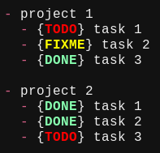

# notator.nvim

Simple Neovim plugin to add styled annotation tags to items in a `markdown` list.



Default keybindings:

| Key         | Action                                        |
| ---         | ---                                           |
| `<Leader>0` | add a tag (the first one)                     |
| `<Leader>9` | remove a tag                                  |
| `<Leader>8` | move the cursor to the first word in the line |
| `<Leader>1` | change to the 1st tag                         |
| `<Leader>2` | change to the 2nd tag                         |
| `<Leader>3` | change to the 3rd tag                         |

You may define as many tags as you want; the defaults are:
```
TODO
FIXME
DONE
```

The annotation tags, their styles, and other options may be set with the `setup` function's configuration table argument. Here's an example demonstrating all the settings and their defaults:
```lua
require('notator').setup({
  -- a table of the annotation tags together with their styles; see below for
  -- more information, e.g., how to customize their keybindings
  tag_table = {
    { name = 'TODO',  color = 'red'        },
    { name = 'FIXME', color = 'yellow'     },
    { name = 'DONE',  color = 'lightgreen' },
  },
  -- boolean setting whether all tags should be the same width;
  -- if true, all tags will use the width of the largest tag
  fixed_width = false,
  -- additional keybindings
  keybindings = {
    add_tag           = [[<Leader>0]], -- add a tag
    remove_tag        = [[<Leader>9]], -- remove a tag
    move_to_beginning = [[<Leader>8]], -- move cursor to the first word
  }
})
```
- `lazy.nvim` users may set these options with the `opts` table in the plugin spec.

`tag_table` accepts the following optional `string` properties:

| Property | Description                                                                           |
| ---      | ---                                                                                   |
| name     | the name of the tag; it's best to use all-caps                                        |
| color    | the color of the tag                                                                  |
| style    | the style of the tag (e.g., `'bold'`)                                                 |
| key      | custom keybinding; by default it is '<Leader>' + the index of this tag in `tag_table` |
